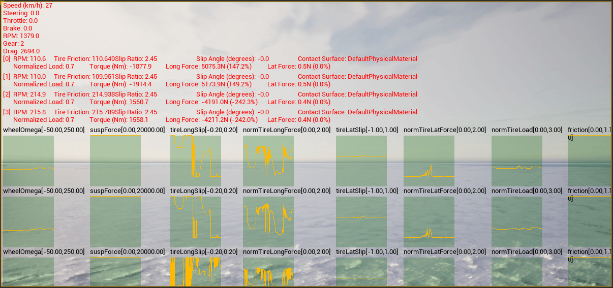

# Control and monitor vehicle physics

Physics properties can be tuned for vehicles and their wheels.
These changes are applied **only** on runtime, and values are set back to default when the execution ends.

These properties are controlled through a
[carla.VehiclePhysicsControl](python_api.md#carla.VehiclePhysicsControl) object,
which also provides the control of each wheel's physics through a
[carla.WheelPhysicsControl](python_api.md#carla.WheelPhysicsControl) object.

- [__Vehicle control code example__](#vehicle-control-code-example)
- [__Viewing vehicle telemetry__](#viewing-vehicle-telemetry)

---
## Vehicle control code example

```py
import carla
import random

def main():
    # Connect to client
    client = carla.Client('127.0.0.1', 2000)
    client.set_timeout(2.0)

    # Get World and Actors
    world = client.get_world()
    actors = world.get_actors()

    # Get a random vehicle from world (there should be one at least)
    vehicle = random.choice([actor for actor in actors if 'vehicle' in actor.type_id])

    # Create Wheels Physics Control
    front_left_wheel  = carla.WheelPhysicsControl(tire_friction=2.0, damping_rate=1.5, max_steer_angle=70.0, long_stiff_value=1000)
    front_right_wheel = carla.WheelPhysicsControl(tire_friction=2.0, damping_rate=1.5, max_steer_angle=70.0, long_stiff_value=1000)
    rear_left_wheel   = carla.WheelPhysicsControl(tire_friction=3.0, damping_rate=1.5, max_steer_angle=0.0,  long_stiff_value=1000)
    rear_right_wheel  = carla.WheelPhysicsControl(tire_friction=3.0, damping_rate=1.5, max_steer_angle=0.0,  long_stiff_value=1000)

    wheels = [front_left_wheel, front_right_wheel, rear_left_wheel, rear_right_wheel]

    # Change Vehicle Physics Control parameters of the vehicle
    physics_control = vehicle.get_physics_control()

    physics_control.torque_curve = [carla.Vector2D(x=0, y=400), carla.Vector2D(x=1300, y=600)]
    physics_control.max_rpm = 10000
    physics_control.moi = 1.0
    physics_control.damping_rate_full_throttle = 0.0
    physics_control.use_gear_autobox = True
    physics_control.gear_switch_time = 0.5
    physics_control.clutch_strength = 10
    physics_control.mass = 10000
    physics_control.drag_coefficient = 0.25
    physics_control.steering_curve = [carla.Vector2D(x=0, y=1), carla.Vector2D(x=100, y=1), carla.Vector2D(x=300, y=1)]
    physics_control.use_sweep_wheel_collision = True
    physics_control.wheels = wheels

    # Apply Vehicle Physics Control for the vehicle
    vehicle.apply_physics_control(physics_control)
    print(physics_control)

if __name__ == '__main__':
    main()
```

---

## Viewing vehicle telemetry

Vehicle telemetry can be visualised by calling the [`Actor.enable_debug_telemetry`](python_api.md#carla.Actor.enable_debug_telemetry) method. This will provide graph views of several metrics on the server window as well as vehicle reference points on the simulation window.



You can try the telemetry visualisation tool in the example script `manual_control.py` located in `PythonAPI/examples`.
